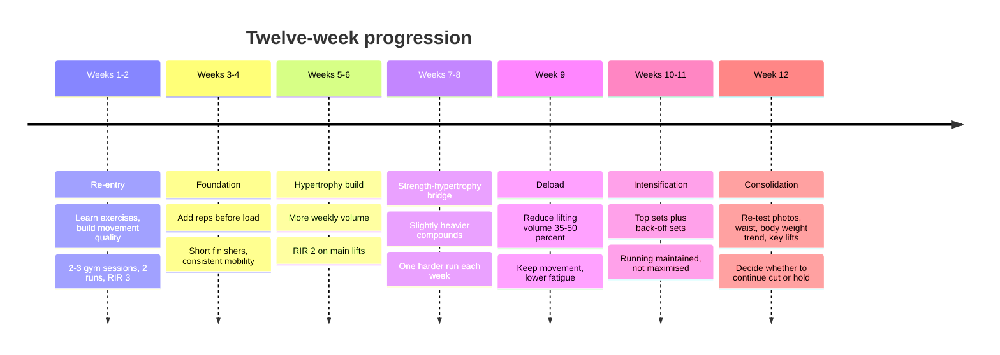
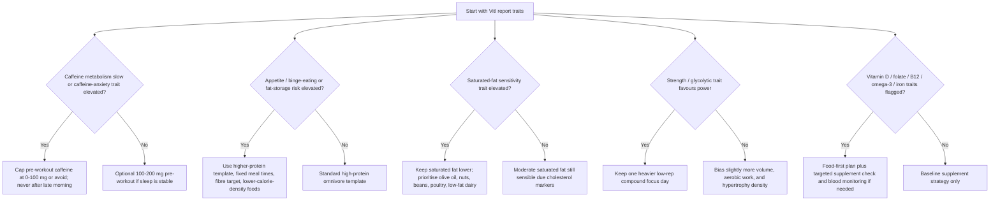

# Personalised Fitness and Nutrition Programme for Lean Muscle and Fat Loss

## Executive summary

Your health report shows a strong base to build from: height 184 cm, weight 95.8 kg, BMI 28.3, waist 100 cm, body fat 23.2%, blood pressure 130/78 mmHg, normal ECG, and no exercise restrictions stated. The report also flags a meaningful movement bottleneck in shoulder mobility and mildly raised cholesterol markers, which make a full-body resistance plan, regular aerobic work, and a heart-healthier diet especially sensible. fileciteturn0file0

The key reality check is this: if you kept your current lean mass and reduced body weight from 95.8 kg to 89 kg, your estimated body fat would still be about 17.3%. That is noticeably leaner and more athletic, but not usually “ripped” in the bodybuilding sense. At your current estimated lean mass, 10–12% body fat would correspond to roughly 81.7–83.6 kg, unless you add substantial muscle while dieting. In practice, the best framing is a two-stage approach: first reach about 89–91 kg while improving strength, posture and running fitness; then decide whether to continue cutting towards a visibly “ripped” look or hold and recomp. citeturn20calculator0turn20calculator2turn20calculator3turn20calculator4

A realistic twelve-week outcome, assuming good adherence, is a loss of about 4–7 kg, a waist reduction of roughly 4–8 cm, improved upper-body movement quality, and measurable gains in major lifts. That pace aligns with public-health guidance to lose around 0.5–1.0 kg per week, while your programme keeps the deficit more moderate and protein higher to protect lean mass. citeturn50view0turn43view0turn43view2

The programme below is built around what the evidence supports best for your constraints: two or three full-body gym sessions per week, two running sessions most weeks, daily shoulder/thoracic mobility, a modest calorie deficit, high protein, and simple progression rules. The DNA section is deliberately conditional rather than deterministic because Vitl’s publicly visible documentation explains the trait categories and methodology, but does not publish the exact SNP list used for each trait; where markers are named below, they should be treated as likely/common nutrigenetic markers rather than confirmed calls from the visible documentation. citeturn10view0turn11view0turn9view0

## Starting point and assumptions

The report suggests you are medically well enough to train productively, but not to treat friction points lightly. The most relevant inputs for programme design are: body fat 23.2%, waist 100 cm, mildly elevated total cholesterol/LDL-related markers, shoulder mobility limitation in the movement screen, broken sleep, asthma history, and no stated orthopaedic restrictions beyond posture/mobility concerns. The practical implication is not “avoid hard training”; it is “train hard with smart exercise selection, controlled fatigue, and a daily mobility habit”. fileciteturn0file0

Vitl states that its DNA test is a saliva-based test processed by Illumina-certified laboratory partners, producing 40 insights across diet/intolerance, fitness, sleep/energy, vitamin levels and related categories. The company publicly lists traits directly relevant here, including appetite and binge eating, saturated-fat response, caffeine-induced anxiety, caffeine metabolism, fat-versus-muscle composition, glycotic capacity in strength training, lipid and glucose metabolism in speed sports, and vitamin-related traits including vitamin D, B12, folate, omega-3 and iron. Vitl also states that it integrates DNA with diet/lifestyle data and, where available, blood results for personalised recommendations. citeturn10view0turn11view0turn9view0

The biggest assumption is that I do **not** have a human-readable trait-by-trait Vitl output listing your exact marker calls. Because of that, the DNA-informed section uses conditional rules: “if your Vitl report flags X, do Y”. That is the most rigorous way to use the available material without pretending to know genotype interpretations that were not explicitly disclosed in the visible documentation. citeturn10view0turn11view0

## Programme architecture

The weekly framework is built around the minimum-effective-dose principle: two full-body lifts are the non-negotiable floor, a third lift is the best option when schedule and recovery allow, and running is used to increase energy expenditure, improve cardiovascular fitness and support health markers without turning the week into an exhausting endurance block. Adults should accumulate at least 150 minutes of moderate physical activity or 75 minutes of vigorous activity weekly, plus muscle-strengthening work on at least two days per week, so your plan deliberately checks both boxes. citeturn32view0

### Training split comparison

| Split | What it looks like | Best for | Main upside | Main trade-off |
|---|---|---|---|---|
| **Two full-body gym days** | Mon/Thu lifts, 2 runs, daily mobility | Busy weeks; consistency first | Highest adherence; easy recovery; hits CDC minimum strength target | Each session is longer and more exercise-dense |
| **Three full-body gym days** | Mon/Wed/Fri lifts, 1–2 runs, daily mobility | Best body-composition progress if schedule allows | More weekly lifting volume and easier per-session workload | More logistics; more recovery demand |
| **Two gym days plus running emphasis** | Tue/Fri lifts, 3 runs, daily mobility | Fat-loss phases; race/event motivation | Raises weekly calorie burn and aerobic fitness | More interference risk if run intensity is too high |

For your stated goal, the best default is **three full-body sessions when possible, but programmed so the week still works perfectly as two sessions**. That gives you an “elastic” plan rather than a fragile one. This is also consistent with the evidence-based point that the most important variables are weekly work completed and long-term adherence, not a perfect body-part split. citeturn32view0turn43view0turn43view2

### Sample weekly schedule

| Day | Primary focus | Secondary focus |
|---|---|---|
| **Monday** | Gym Session A | 8–10 min post-lift conditioning |
| **Tuesday** | Easy run 30–45 min | Mobility routine |
| **Wednesday** | Gym Session B | Walks / steps / mobility |
| **Thursday** | Optional tempo or intervals | Mobility routine |
| **Friday** | Gym Session C **or** rest if only training twice | Light walk |
| **Saturday** | Easy outdoor activity / parkrun-style easy effort | Mobility |
| **Sunday** | Rest / long walk | Weekly review and prep |

On a two-session week, keep **Session A** and **Session B**, add the easy run and one quality run, and drop Session C. On a recovery-stressed week, keep both lifts, keep only the easy run, and extend walking instead. That preserves the core stimulus while managing sleep, work stress and shoulder recovery. citeturn32view0turn50view0

### Training progression visual

## Twelve-week training plan

### Progression principles

Use a **double-progression** model. Keep the prescribed rep range, and only add load when you hit the top of the range on all working sets with solid form and the target effort. Most sets should finish with around **2–3 reps in reserve** early in the block, tightening to **1–2 reps in reserve** during harder weeks. This is a practical way to deliver progressive overload while protecting your shoulders and maintaining run quality. citeturn52search1turn32view0

Because you have shoulder mobility/posture issues, exercise selection should emphasise movements that are easier to stabilise: neutral-grip pressing, landmine pressing, chest-supported rows, pulldowns, trap-bar deadlifts, goblet/front-loaded squats, split squats, carries, and controlled push-up variations. Overhead barbell work is optional rather than essential. fileciteturn0file0

### Weekly microcycles

| Week | Gym focus | Running focus | Intensity target | Notes |
|---|---|---|---|---|
| **Week one** | 2 sessions minimum, 3 optional | 1 easy run + 1 brisk walk/run | Easy-moderate | Learn technique, film top sets |
| **Week two** | Same lifts, add 1 set on key patterns | 2 easy runs | Moderate | Shoulder work daily |
| **Week three** | Add reps on compounds | 1 easy run + 1 short tempo | Moderate | Steps 8k–10k/day |
| **Week four** | Match week three, slightly heavier where earned | 1 easy run + 1 interval-lite | Moderate-hard | First check-in week |
| **Week five** | Volume bump on chest/back/legs | 1 easy run + 1 tempo | Hard but controlled | Protein strictness matters |
| **Week six** | Keep volume, add load where reps topped out | 1 easy run + 1 interval session | Hard | Watch sleep and appetite |
| **Week seven** | Main lifts slightly heavier, accessories steady | 1 easy run + 1 tempo/threshold | Hard | Do not chase PBs on every lift |
| **Week eight** | Similar to week seven | 1 easy run + 1 interval session | Hard | Photos and waist check |
| **Week nine** | Deload, cut sets 35–50% | 2 easy aerobic sessions | Easy | No grinders |
| **Week ten** | Resume with slightly heavier compounds | 1 easy run + 1 tempo | Moderate-hard | Best week for momentum |
| **Week eleven** | Peak work capacity for this block | 1 easy run + 1 interval session | Hard | Keep technique clean |
| **Week twelve** | Consolidate, lower accessory fatigue | 1 easy run | Moderate | Re-test measurements |

### Session templates

#### Gym Session A

| Exercise | Sets x reps | Notes |
|---|---:|---|
| Safety-bar squat, front squat, or leg press | 3–4 × 5–8 | Controlled eccentric |
| Dumbbell bench press or machine chest press | 3–4 × 6–10 | Neutral or semi-neutral grip |
| Chest-supported row | 3–4 × 8–12 | Pause at contraction |
| Romanian deadlift | 3 × 6–10 | Hips back, ribs down |
| Rear-foot-elevated split squat | 2–3 × 8–12/side | Moderate load |
| Cable lateral raise | 2–3 × 12–15 | Scapula controlled |
| Pallof press or dead bug | 2–3 × 8–12 | Anti-rotation focus |
| Bike/rower finisher | 6–8 min | 30s steady-hard / 60s easy |

#### Gym Session B

| Exercise | Sets x reps | Notes |
|---|---:|---|
| Trap-bar deadlift or conventional deadlift | 3–4 × 4–6 | Crisp reps, no grinders |
| Incline dumbbell press or landmine press | 3–4 × 6–10 | Shoulder-friendly pressing |
| Lat pulldown or assisted chin-up | 3–4 × 6–10 | Full stretch |
| Leg press or hack squat | 3 × 8–12 | Quads hard |
| Seated hamstring curl | 2–3 × 10–15 | Full squeeze |
| Face pull or cable Y-raise | 2–3 × 12–15 | Posture bias |
| Farmer carry | 3 × 30–40 m | Ribcage stacked |
| Optional easy cardio cooldown | 5–10 min | Nose-breathing pace |

#### Gym Session C

| Exercise | Sets x reps | Notes |
|---|---:|---|
| Goblet squat or front squat | 3 × 8–10 | Quality over load |
| Hip thrust or 45° back extension | 3 × 8–12 | Glute focus |
| One-arm cable row or low row | 3 × 8–12 | Scapular control |
| Push-up progression or machine press | 3 × 8–15 | Leave 1–2 reps in reserve |
| Walking lunge | 2–3 × 10–12/side | Light to moderate |
| Cable curl superset rope pressdown | 2–3 × 10–15 each | Optional arm volume |
| Sled push / bike intervals | 8–10 min | Short, hard, low skill |

### Running sessions

Keep one run almost always **easy aerobic**. This should feel conversational, roughly zone-two effort, and finish fresher than you started. Its purpose is fat-loss support, aerobic base and recovery, not heroics. citeturn32view0turn35view0

The second run alternates by phase:

| Phase | Quality run |
|---|---|
| **Weeks one to four** | 6 × 1 min steady-hard / 2 min easy |
| **Weeks five to eight** | 3 × 6 min tempo / 3 min easy |
| **Week nine** | No hard running; easy only |
| **Weeks ten to twelve** | 5 × 3 min 10k-ish effort / 2 min easy |

If legs feel flat, put the quality run at least 24 hours away from your heavier lower-body lift. If recovery is poor, drop intensity before dropping consistency. That is especially important because your work target is body recomposition, not maximal endurance performance. citeturn32view0turn50view0

## Mobility and posture programme

Your report specifically flags upper-shoulder mobility/posture as an issue, so this cannot be an afterthought. The aim is not to “fix posture” with one magical drill; it is to improve thoracic extension/rotation, shoulder flexion mechanics, serratus function, lower-trap support and pressing/rowing control. fileciteturn0file0

### Daily routine

Do this once daily, ideally as a 10–12 minute block. On gym days, do the first five items in the warm-up and the remaining items after training or later in the day.

| Drill | Dose | Why it is in the plan |
|---|---:|---|
| 90/90 breathing with feet on wall | 5 breaths × 2 rounds | Ribcage position; reduces “flared chest” set-up |
| Foam-roller thoracic extensions | 6–8 reps | Improves upper-back extension access |
| Open book or thread-the-needle | 6 reps/side | Thoracic rotation |
| Doorway pec stretch | 30–45 sec × 2/side | Reduces anterior shoulder tightness |
| Wall slides with lift-off | 2 × 8 | Shoulder upward rotation |
| Serratus wall slide or push-up plus | 2 × 8–12 | Serratus activation |
| Band pull-apart or face pull | 2 × 12–15 | Mid-back and rear-delt endurance |
| Scapular hang or active hang | 2 × 15–30 sec | Shoulder position tolerance |

### Progression by phase

| Phase | Priority | Progression |
|---|---|---|
| **Weeks one to four** | Mobility access | More thoracic work, light activation, controlled tempo |
| **Weeks five to eight** | Stability | Add load to wall slides, face pulls, carries, push-up plus |
| **Weeks nine to twelve** | Integration | Keep mobility volume, increase loaded carries, rowing quality, controlled pressing range |

### Gym warm-up sequence

Before each gym session, use this order:

1. Five minutes light bike/row.
2. Thoracic extension on roller.
3. Open books.
4. Wall slides.
5. One serratus drill.
6. Two ramp-up sets for the first press and row.

If a pressing movement causes pinching in the front of the shoulder, switch that day to a neutral-grip dumbbell press, machine press, or landmine press and reduce range to pain-free territory. Sharp pain, numbness, or neck-radiating symptoms are reasons to stop improvising and see a physio. fileciteturn0file0

## Nutrition strategy

### Calorie targets and rate of loss

A strong starting point is a **weekly average intake around 2,350–2,500 kcal/day**, split roughly as follows:

| Day type | Calories | Protein | Carbohydrate | Fat |
|---|---:|---:|---:|---:|
| **Training day** | 2,450–2,650 kcal | 180–210 g | 220–300 g | 65–80 g |
| **Rest / easy day** | 2,200–2,350 kcal | 180–210 g | 140–220 g | 70–85 g |

This is deliberately a **moderate** deficit, not an aggressive one. Public-health guidance commonly targets roughly 0.5–1.0 kg per week for weight loss; for your goal of fat loss with lean-muscle retention, I would aim for the lower-middle part of that range, about **0.4–0.7 kg per week** on average. If your rolling two-week average is dropping slower than about 0.25 kg/week, reduce intake by 100–150 kcal/day; if it is falling faster than about 0.8 kg/week and gym performance is sliding, add back 100–150 kcal/day. citeturn50view0turn43view0turn43view2turn47search5

### Macro strategy

Protein is the anchor. Make it consistent every day and distribute it across three to five feedings. A practical target is **35–50 g protein per main meal**, plus one protein-rich snack or shake if needed. The evidence on timing suggests that total daily protein matters more than obsessing over a narrow “anabolic window”, but getting a protein feeding in the several hours before or after training is still pragmatic. citeturn43view0turn43view2

Carbohydrate should be biased around training: more on gym and harder-run days, less on rest days. That supports lifting quality, preserves running legs, and helps appetite management. Fat intake should stay moderate rather than ultra-low, but because your report shows mildly raised cholesterol markers, keep saturated fat controlled and bias dietary fat towards olive oil, nuts, seeds, avocado, eggs, dairy in sensible portions, and leaner cuts of meat. Increasing soluble fibre, legumes and oats is particularly useful. citeturn35view0turn61view0

### Diet template comparison

| Template | Best fit | Example macro feel | Pros | Cons |
|---|---|---|---|---|
| **Omnivore** | Easiest default for you | High protein, moderate carbs, moderate fat | Simplest route to 180–210 g protein; varied micronutrients | Requires attention to saturated fat and processed meat intake |
| **Vegetarian** | Good if you want more fibre and lower saturated fat | High protein, higher carbs, moderate fat | Can support cholesterol and fibre goals well | B12, iron and total protein need more planning |
| **High-protein omnivore** | Best during faster-cut weeks | Very high protein, moderate carbs, lower-moderate fat | Best satiety; easiest lean-mass protection | Can become repetitive if meals are not planned well |

**Best-fit recommendation:** start with an **omnivore, high-protein Mediterranean-leaning pattern**: poultry, lean beef in moderation, eggs, Greek yoghurt, cottage cheese, whey, beans/lentils, potatoes, rice, oats, wholegrain wraps, fruit, lots of vegetables, olive oil, nuts and seeds. That best matches your goal, dislikes, and cholesterol context. citeturn35view0turn50view0turn61view0

### Sample day plans

#### Omnivore template

| Meal | Food | Approx. protein |
|---|---|---:|
| Breakfast | Greek yoghurt, oats, whey, berries, chia | 45 g |
| Lunch | Chicken, rice, roasted peppers/onions/broccoli, olive-oil yoghurt dressing | 50 g |
| Snack | Cottage cheese, apple, walnuts | 30 g |
| Dinner | Turkey meatballs in cooked tomato-basil sauce with pasta and spinach | 50 g |
| Post-run or pre-bed | Milk or casein shake | 25–30 g |

#### Vegetarian template

| Meal | Food | Approx. protein |
|---|---|---:|
| Breakfast | Protein porridge with soy milk, whey or soy isolate, banana, peanut butter | 35–40 g |
| Lunch | Paneer and chickpea tikka bowl with rice and cucumber-yoghurt | 40–45 g |
| Snack | Skyr or high-protein yoghurt with berries | 20–25 g |
| Dinner | Lentil and tofu chilli with rice, grated cheddar, avocado | 45–50 g |
| Pre-bed | Casein or soy isolate shake | 25–30 g |

#### High-protein template

| Meal | Food | Approx. protein |
|---|---|---:|
| Breakfast | Omelette with eggs, egg whites, spinach and reduced-fat cheese; toast | 45–50 g |
| Lunch | Beef mince burrito bowl with beans, rice, peppers, cooked salsa | 50 g |
| Snack | Whey shake and fruit | 25–30 g |
| Dinner | Chicken thigh traybake with potatoes, carrots and green beans | 50–55 g |
| Pre-bed | Cottage cheese with cinnamon and berries | 25–30 g |

### Simple recipe bank

**Chicken and roasted pepper grain bowl.** Roast chicken breast or boneless thighs with paprika, garlic and lemon. Serve over microwave rice or quinoa with roasted peppers, onions and broccoli, plus Greek yoghurt mixed with herbs and a little olive oil. Easy, high-protein, shoulder-friendly from a life-management perspective because it is batch-cookable.

**Turkey meatballs in tomato-basil sauce.** Use 5% turkey mince, breadcrumbs or oats, egg, garlic, parmesan and herbs. Bake, then simmer in cooked tomato passata with basil and chilli flakes. Serve with pasta or potatoes and wilted spinach. Works around your dislike of raw tomatoes because the tomatoes are cooked.

**Beef and bean chilli.** Lean beef mince, onions, peppers, garlic, beans, passata, stock and spices. Serve with rice, grated cheese and yoghurt. Excellent for meal prep and fibre.

**Paneer or tofu tikka traybake.** Paneer or extra-firm tofu with tikka spices, peppers and onions. Roast and serve with rice, lentils and mint yoghurt.

**High-protein overnight oats.** Oats, Greek yoghurt, milk, whey, berries and chia. This is one of the easiest ways to keep breakfast from becoming a protein weak spot.

### Protein timing and supplementation

The evidence does **not** support stressing over a very narrow post-workout window. What matters more is total daily protein intake. Still, for convenience and appetite control, a good rule is **25–40 g of protein within about one to two hours after lifting or running**, especially if the surrounding meals are far apart. citeturn43view0turn43view2

For supplements, the shortlist is deliberately boring:

| Supplement | Practical recommendation | Why |
|---|---|---|
| **Creatine monohydrate** | 3–5 g daily, any time | Best-supported ergogenic aid for high-intensity training and lean-mass support |
| **Whey or casein** | Use to fill protein gaps, not as mandatory magic | Makes 180–210 g/day realistic |
| **Vitamin D** | In the UK, 10 mcg per day in autumn/winter is the default public-health advice | Sensible baseline, especially if low sun exposure |
| **Algal omega-3** | Optional because you dislike fish/seafood | Practical EPA/DHA alternative to fish oil |
| **Caffeine** | Optional, not essential; dose depends heavily on sleep/anxiety and any Vitl caffeine findings | Can help performance, but may worsen anxiety/sleep in some people |

Creatine has one of the strongest evidence bases in sports nutrition. The ISSN position stand describes creatine monohydrate as the most effective ergogenic nutritional supplement for increasing high-intensity exercise capacity and lean body mass during training, and reports it as safe and well-tolerated in healthy individuals. A loading phase of about 5 g four times daily for 5–7 days works quickly, but **3–5 g/day without loading** is simpler and usually preferable. citeturn44view2turn44view0turn43view3

Vitamin D is worth handling conservatively rather than heroically. NHS guidance states that adults should consider a 10 microgram daily vitamin D supplement during autumn and winter, and year-round if they get little sun exposure. citeturn60view0

Because you dislike fish and seafood, algal oil is the cleanest omega-3 workaround if you want an EPA/DHA source. NIH’s Office of Dietary Supplements notes that omega-3 supplements include algal oil, a vegetarian source. citeturn61view0

## DNA-informed adjustments

Vitl publicly states that its DNA test covers nutrition, fitness, caffeine/sleep, and vitamin-status traits, and its science page explicitly uses **MTHFR** as an example of a gene that could alter nutrient form recommendations. However, the publicly visible documentation does not disclose the exact marker list that underpins each trait. The table below therefore shows **likely/common markers** that fit Vitl’s published trait categories and are useful for **conditional decision rules**, not for deterministic claims. citeturn10view0turn11view0turn9view0turn66view3

### Decision flow

### Marker-based recommendation table

| Vitl trait area | Likely/common marker examples | How I would change your programme if flagged |
|---|---|---|
| **Caffeine metabolism** | **CYP1A2 rs762551** | Use little or no pre-workout caffeine; if used, take it early only. This matters even more because your report notes broken sleep, and you reported anxiety/depression history. citeturn10view0turn24view0turn27view0 |
| **Caffeine-induced anxiety** | **ADORA2A rs5751876** | Avoid high-dose caffeine, especially before runs or evening training; prefer creatine and carbs over stimulant reliance. citeturn10view0 |
| **Appetite and binge eating** | **FTO rs9939609**, **MC4R rs17782313** | Keep a fixed meal rhythm, higher protein, and more high-volume foods; do not “save calories” for late-night eating. citeturn10view0 |
| **Use of dietary saturated fats** | **APOA2 rs5082** and similar lipid-response markers | Tighten saturated fat control further and lean harder into poultry, beans, oats, olive oil and nuts, especially because your cholesterol markers are already mildly raised. citeturn10view0turn35view0 |
| **Glycotic capacity in strength training** | **ACTN3 rs1815739** | If the trait favours glycolytic/power capacity, keep one lower-rep heavy compound focus each week. If not, bias slightly more towards moderate reps, density and aerobic support. ACTN3 rs1815739 is the best-known common marker in this area. citeturn10view0turn25view0turn27view1 |
| **Fat versus muscle composition** | Common commercial panels often include **FTO** and performance-related markers | If flagged towards easier fat storage, keep deficit consistency high and moderate weekend overfeeding; if flagged towards leaner composition, do not assume immunity to poor habits. citeturn10view0 |
| **Lipid and glucose metabolism in speed sports** | Often **PPARA**, **PPARGC1A** or related exercise-metabolism markers | Bias the quality run and conditioning style according to tolerance: better glycolytic responders can handle slightly harder intervals; others may do better with tempo and zone-two. citeturn10view0 |
| **Folate handling** | **MTHFR rs1801133** and related folate markers | Prioritise folate-rich foods. If supplementation is needed, methylfolate may be a practical option in some individuals, and Vitl explicitly references methylated folate on its science page; still, do not over-medicalise this trait. citeturn11view0turn66view3turn71view3 |
| **Vitamin D status predisposition** | Commonly **GC**, **CYP2R1**, **DHCR7** in commercial nutrigenetics | Be more consistent with autumn/winter vitamin D and consider testing blood levels if energy, mood, recovery or deficiency risk suggests it. citeturn10view0turn60view0 |
| **Vitamin B12** | Often **FUT2**, **TCN2** or similar status markers | If vegetarian phases are used, be stricter about fortified foods or supplementation; B12 is naturally absent from unfortified plant foods. citeturn10view0turn71view1 |
| **Omega-3 and omega-6** | Often **FADS1/FADS2** markers | Because you dislike fish/seafood, an algal oil supplement is the easiest back-up if the trait suggests lower endogenous long-chain omega-3 status or if usual intake is low. citeturn10view0turn61view0 |
| **Iron** | Often **HFE**, **TMPRSS6** or related markers | Do not supplement iron blindly. Use food-first strategies and blood work if fatigue, vegetarian intake, or lab markers indicate a need. Vegetarian eating increases the challenge because non-heme iron is less well absorbed. citeturn10view0turn62view0 |

The most important interpretation rule is this: **DNA markers should fine-tune the programme, not replace fundamentals**. Your calorie balance, protein intake, training consistency, sleep and recovery will still explain far more of the outcome than any single common SNP. Vitl’s own model is built on that same principle; the company states that DNA is integrated with diet, lifestyle and, where available, blood results rather than used in isolation. citeturn10view0turn9view0

## Expected outcomes and limitations

### Expected timelines

If adherence is high, the realistic timeline is:

| Outcome | Realistic range |
|---|---|
| **Weekly body-weight change** | about 0.4–0.7 kg down |
| **Twelve-week change** | about 4–7 kg down |
| **Time to ~89 kg** | roughly 10–16 weeks |
| **Likely body-fat range at 89 kg if lean mass is maintained** | about 17% |
| **Time to a very “ripped” look** | likely longer than 12 weeks; often another 8–16+ weeks depending on muscle retention and how lean you want to be |

These are estimates, not promises, but they are grounded in your current measured body composition and realistic weekly loss rates. citeturn20calculator0turn20calculator2turn50view0

### Measurement plan

Use four markers, not one:

| Marker | Frequency |
|---|---|
| Scale weight | Daily, morning, then use 7-day average |
| Waist circumference | Weekly |
| Front/side/back photos | Every two weeks |
| Gym logbook performance | Every session |

If the scale stalls for ten to fourteen days but waist falls and lifts hold steady, do **not** panic; that often means recomp is happening. If weight falls fast but waist does not and gym performance collapses, the deficit is probably too deep.

### Open questions and limitations

This report is rigorous but still has limits. The visible Vitl documentation does not publish the exact SNP list for each trait, so the DNA section uses conditional, likely-marker interpretations rather than confirmed trait calls from a human-readable Vitl result page. citeturn10view0turn11view0

I have also assumed that there are no unstated medical constraints beyond those noted in your health report. If you have a current shoulder pain diagnosis, asthma exacerbation risk, a clinician-advised restriction, or any medication issue that affects heart rate, blood pressure, appetite or recovery, the final programme should be adjusted accordingly. fileciteturn0file0

The practical bottom line is simple: **make 89 kg your first milestone, not the final identity statement**. Over the next twelve weeks, the most evidence-based path is to get lighter, stronger, more mobile and more aerobically fit at the same time. Once you reach about 89–91 kg, you will be in a much better position to decide whether you want a further fat-loss phase for a truly “ripped” look or a maintenance/recomp block to add more muscle before cutting again. citeturn20calculator2turn20calculator3turn20calculator4